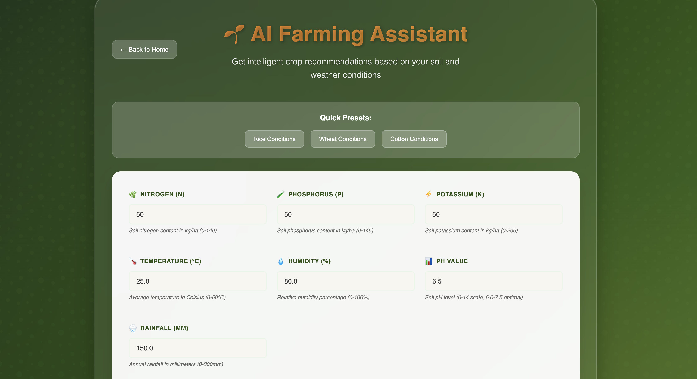

# Cultiv – AI-Powered Farming Platform



## 🚜 Project Summary  
Cultiv is an integrated digital platform designed for modern farmers. It blends artificial intelligence, machine learning, and agricultural operations into one accessible solution — empowering farmers to:  
- Identify the **optimal crop to grow next**, based on soil, weather, and market data.  
- Receive **targeted pesticide and treatment recommendations** to proactively manage pests and disease.  
- **Hire skilled labourers** with full transparency: view worker profiles including years of experience, crop types handled previously, and skills.  
- **Rent farming machinery and equipment** directly through the platform, managing availability and deployment seamlessly.  


## 🧠 Core Features  
- **AI/ML-Driven Crop Recommendation**  
  - Analyse soil composition, weather patterns, and current market trends.  
  - Suggest next-season crops with highest profit potential.  
- **Pest & Treatment Advisor**  
  - Use environmental data + crop type to alert pests, diseases.  
  - Recommend safe, effective pesticide usage.  
- **Labour Marketplace**  
  - Farmers can view and hire labourers.  
  - Worker profiles include: previous crops handled, total years of experience, skill set.  
- **Machine/Equipment Rental**  
  - Catalogue of farming machines available for rent.  
  - Booking and scheduling integrated into the farmer’s dashboard.  


## 🧩 Tech Stack  
- Front-end: React + html + css
- Back-end: Flask  
- AI/ML: Python with libraries like pandas, scikit-learn
- Database: Firebase


## 📁 Project Structure  
/cultiv
├── backend/ # Datasets + training scripts for AI/ML features
├── src/ 
├── index.html
└── README.md 


src/

├── components/         # Reusable UI components

├── contexts/           # React contexts (Language, Auth)

├── pages/              # Main application pages

├── services/           # Firebase and API services

├── styles/             # CSS modules and themes

└── assets/             # Images and static files


## 🏁 Getting Started  
### Prerequisites  
- Node.js (v14+) / Python (3.x)  
- Database (PostgreSQL / MySQL / MongoDB)  
- Understanding of your local environment setup  

### Installation  
```bash

npm install react react-dom react-router-dom firebase
npm install -D @vitejs/plugin-react vite

# Clone the repo
git clone https://github.com/mohitrohda/Cultiv.git
cd Cultiv
npm run dev

# Set up back-end
cd backend
python3 app.py

